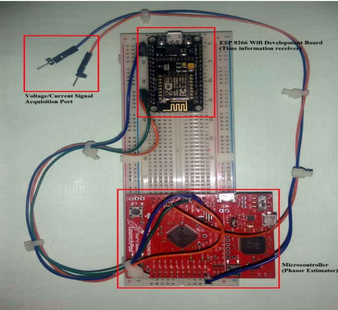

## Micro-Phasor Measurement Unit

Implementation of Micro-PMU, for the papers:

  > [Development of a micro-phasor measurement unit for distribution system applications](http://www.iitk.ac.in/npsc/Papers/NPSC2016/1570291677.pdf)\
  > Hari Prasanna Das, Ashok Kumar Pradhan
  
  > [Micro-Phasor Measurement Unit (μPMU) Development and its Applications](http://hariprasanna.com/papers/pdf/BTP_Final_Report.pdf)\
  > Hari Prasanna Das
 

## Usage 
  ### Hardware Requirement: 
  TM4C123G microcontroller (from Texas Instruments) and ESP 8266 WiFi module
  ### Software Requirement: 
  IAR Embedded Workbench (from IAR Systems) for Microcontroller and Arduino IDE (from Arduino) for ESP 8266 WiFi module

## Prototype

